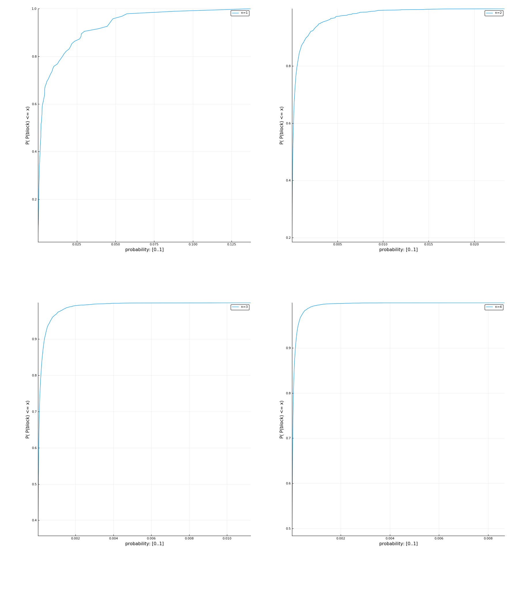
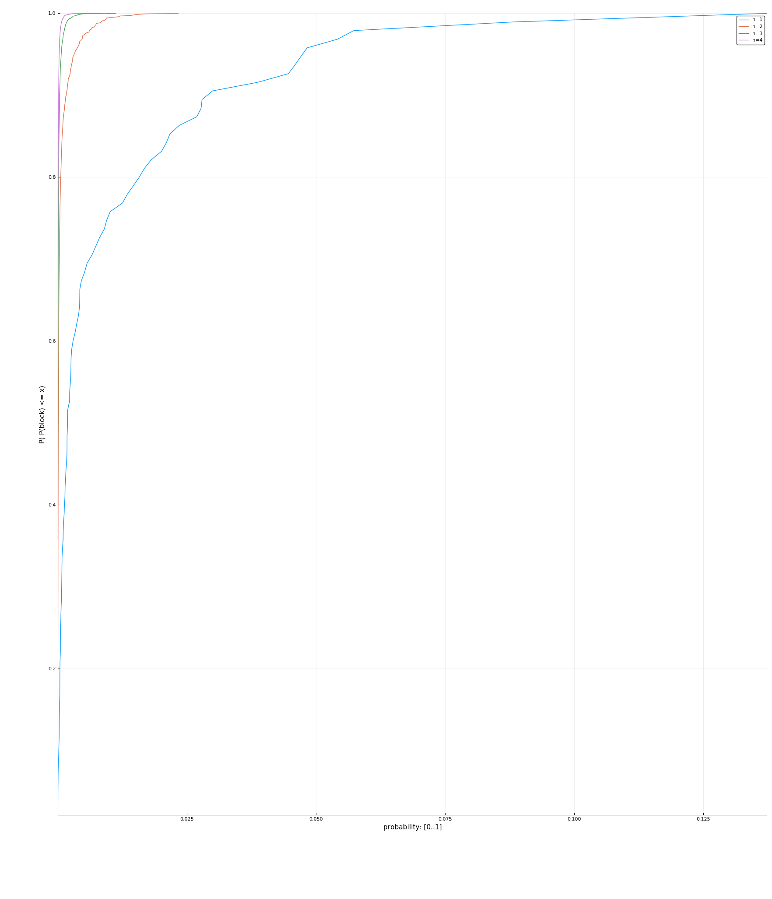

# HW report

|   |   |
| -- | -- |
| Performer| George Agapov |
| Date | 2017 Dec 17 |

## Task 1

|   |   |
| -- | -- |
| File | PAPER1 (Calgary) |
| File size | 53161 bytes |
| Variant | 8 |

In following table dependence of `n`, `H_n = H(X^n)/n`, `H(X|X^n-1)` is shown:


| `n` | `H_n(x)` |`H(X\|X^n-1)`| Code words | `H(X\|X^n-1) * file_size / 8` | `H(X\|X^n-1) * file_size / 8 + codewords * n` |
| ------------- | ------------- | ----- | ----- | ----- | ----- |
| 1 | 4.983 | 4.983 | 95 | 33112.542 | 33207.542 |
| 2 | 4.315 | 3.646 | 1556 | 24228.635 | 27340.635 |
| 3 | 3.654 | 2.332 | 6155 | 15494.634 | 33959.634 |
| 4 | 3.092 | 1.407 | 12841 | 9347.392 | 60711.392 |
| 5 | 2.654 | 0.904 | 19841 | 6009.320 | 105214.320 |
| 6 | 2.317 | 0.630 | 26074 | 4188.156 | 160632.156 |
| 7 | 2.050 | 0.445 | 31225 | 2958.921 | 221533.921 |
| 8 | 1.832 | 0.312 | 35446 | 2075.866 | 285643.866 |


Probability distribution function for n = 1..4





File was applied to different archivers:

| Archiver | Result (bytes) |  Compression rate |
| -- | -- | -- |
| Original file | 53161 | 1 |
| 7zip | 17339 | 3.06598 |
| bzip2 | 16558 | 3.21059 |
| gzip | 18579 |  2.86135 |

So comparing to `H(X|X^n-1)` with `n > 3` archivers perform worse.
But we also need to transfer alphabet.
Doing it in silliest way would result into `codewords * n` amount of bytes,
which being added to estimation done with `H(X|X^n-1)` gives much worse result than eany of archivers tested.


Note, that header for bzip2 is approximately 14-40 bytes (so doesn't change comparison results).

## Task 2

|   |   |
| -- | -- |
| Variant | 8 |

Matrix A for Markov chain with `s=1`: 

```
  0.25000 0.75000 0.00000 
  0.00000 0.25000 0.75000 
  0.75000 0.00000 0.25000 
```

Distribution `p` such that `p*A=p`:
`p = 0.33333 0.33333 0.33333 `

### Entropy calculation

`H(X) = 1.58496`

`H(X|X^n) = H(X|X^s) = H(X|X) = 0.81128`

`H_n(X) = H(X|X) + ( H(X) - H(X|X) )/n = 0.81128 + 0.77368/n`

### Huffman lengths for X

|Symbol|Probability|Length|
| -- | -- | -- |
| a | 0.33333 | 2 |
| b | 0.33333 | 1 |
| c | 0.33333 | 2 |

`R_1 = 1.66667`

### Huffman lengths for X^2

|Symbol|Probability|Length|
| -- | -- | -- |
| aa | 0.08333 | 4 |
| ab | 0.25000 | 4 |
| bb | 0.08333 | 3 |
| bc | 0.25000 | 2 |
| ca | 0.25000 | 4 |
| cc | 0.08333 | 4 |

`R_2 = 1.70833`

## Task 3

|   |   |
| -- | -- |
| Variant | 17 |

Proverb: `Better late than never but better never late.`

Length: `360` bits.


# Two-phase Huffman encoding

Code word is combined from two parts: `c(x) = c1(x) + c2(x)`:
* `c1(x)` for alphabet encoding
* `c2(x)` for data sequence

Code words:

|Char|Probability|Codeword|
|--|--|--|
| |7/45|"100"|
|.|1/45|"111110"|
|B|1/45|"111111"|
|a|3/45|"1011"|
|b|2/45|"11100"|
|e|10/45|"01"|
|h|1/45|"111100"|
|l|2/45|"11101"|
|n|3/45|"1100"|
|r|4/45|"1101"|
|t|8/45|"00"|
|u|1/45|"111101"|
|v|2/45|"1010"|


Encoding trace:

|Char|Probability|Codeword|Total length|
|--|--|--|--|
|B|1/45|111111|6|
|e|2/9|01|8|
|t|8/45|00|10|
|t|8/45|00|12|
|e|2/9|01|14|
|r|4/45|1101|18|
| |7/45|100|21|
|l|2/45|11101|26|
|a|1/15|1011|30|
|t|8/45|00|32|
|e|2/9|01|34|
| |7/45|100|37|
|t|8/45|00|39|
|h|1/45|111100|45|
|a|1/15|1011|49|
|n|1/15|1100|53|
| |7/45|100|56|
|n|1/15|1100|60|
|e|2/9|01|62|
|v|2/45|1010|66|
|e|2/9|01|68|
|r|4/45|1101|72|
| |7/45|100|75|
|b|2/45|11100|80|
|u|1/45|111101|86|
|t|8/45|00|88|
| |7/45|100|91|
|b|2/45|11100|96|
|e|2/9|01|98|
|t|8/45|00|100|
|t|8/45|00|102|
|e|2/9|01|104|
|r|4/45|1101|108|
| |7/45|100|111|
|n|1/15|1100|115|
|e|2/9|01|117|
|v|2/45|1010|121|
|e|2/9|01|123|
|r|4/45|1101|127|
| |7/45|100|130|
|l|2/45|11101|135|
|a|1/15|1011|139|
|t|8/45|00|141|
|e|2/9|01|143|
|.|1/45|111110|149|

Length of data encoded: `length (c2(x)) = 149`

To transfer alphabet we'll transfer amount of leafs on each layer:

|Layer|Nodes on layer|Final nodes|Value range|Bits|
|--|--|--|--|--|
|0|1|0|0..1|1|
|1|2|0|0..2|2|
|2|4|2|0..4|3|
|3|4|1|0..4|3|
|4|6|4|0..6|3|
|5|4|2|0..4|3|
|6|4|4|0..4|3|

Costs to transfer letters (calculated by table above): 

`cost = ⌈log2 ( binomial 256 2 )⌉ + ⌈log2 ( binomial 254 1 )⌉ + ⌈log2 ( binomial 253 4 )⌉ + ⌈log2 ( binomial 249 2 )⌉ + ⌈log2 ( binomial 247 4 )⌉ = 94`


Total length: `18 + 94 + 149 = 261` bit
### Adaptive coding

Log of encoding (with algorithm A):

|Symbol|Probability|Code bits|Message length|
|--|--|--|--|
|esc|1/1||0|
|B|1/256|0100001|7|
|esc|1/2||7|
|e|1/255|00110010|15|
|esc|1/3||15|
|t|1/254|00010011|23|
|t|1/4|00|25|
|e|1/5|000|28|
|esc|1/6|0|29|
|r|1/253|0000101011|39|
|esc|1/7||39|
| |1/252|00000010011|50|
|esc|1/8|1|51|
|l|1/251|000101101|60|
|esc|1/9|011|63|
|a|1/250|001001101|72|
|t|1/5|10|74|
|e|2/11|0|75|
| |1/12|00000|80|
|t|3/13||80|
|esc|1/14|00100|85|
|h|1/249|001000110|94|
|a|1/15|001|97|
|esc|1/16|01|99|
|n|1/248|0000101001|109|
| |2/17|0000|113|
|n|1/18|100|116|
|e|3/19|00|118|
|esc|1/20|00111|123|
|v|1/247|00101011|131|
|e|4/21|00|133|
|r|1/22|0011|137|
| |3/23|00000|142|
|esc|1/24|1110|146|
|b|1/246|001111|152|
|esc|1/25|0010100|159|
|u|1/245|010111|165|
|t|2/13|001|168|
| |4/27|0000|172|
|b|1/28|001|175|
|e|5/29|0001|179|
|t|1/6|01|181|
|t|6/31|0|182|
|e|3/16|000|185|
|r|2/33|001000|191|
| |5/34|000|194|
|n|2/35|100|197|
|e|7/36|001|200|
|v|1/37|10|202|
|e|4/19|0000|206|
|r|1/13|0010|210|
| |3/20|0000|214|
|l|1/41|01100|219|
|a|1/21|00|221|
|t|7/43|0001|225|
|e|9/44|00|227|
|esc|1/45|0011|231|
|.|1/244|000000111|240|
|final|0/1|100101|246|

Total length: `l = ⌈- log2 ( G ) ⌉ + 1 = 246`

Composition: 
`τ = (10, 8, 7, 4, 3, 3, 2, 2, 2, 1, 1, 1, 1, 0, .., 0)`
Composition of sorted composition: `τ' = (1, 1, 1, 1, 2, 3, 4, 243)`

Costs to transfer sequential number of composition (in lexicographically ordered list of all compositions with length `n` over 256-letter alphabet):
`l1 = 23 + 96 = 119`

Costs to transfer number of byte sequence (among all with given composition):
`l2 = 125`
`l = l1 + l2 = 244`
### LZ-77

We compare LZ-77 launched with various params:

|Num encoding|Window|Result|
|--|--|--|
|Unary|50|232|
|Unary|100|232|
|Unary|200|232|
|Unary|500|232|
|Unary|1000|232|
|Unary|2000|232|
|Unary|4000|232|
|Levenshtein|50|233|
|Levenshtein|100|233|
|Levenshtein|200|233|
|Levenshtein|500|233|
|Levenshtein|1000|233|
|Levenshtein|2000|233|
|Levenshtein|4000|233|
|Elias|50|245|
|Elias|100|245|
|Elias|200|245|
|Elias|500|245|
|Elias|1000|245|
|Elias|2000|245|
|Elias|4000|245|


Will show trace of encoding with Unary num encoding, window 50 (result: 232 bits).

|Step|Flag|Letter sequence|`d`|`l`|Code sequence|Bits|Total bits|
|--|--|--|--|--|--|--|--|
|0|0|B||0|001000010|9|9|
|1|0|e||0|001100101|9|18|
|2|0|t||0|001110100|9|27|
|3|1|t|1|1|1010|4|31|
|4|1|e|3|1|10110|5|36|
|5|0|r||0|001110010|9|45|
|6|0| ||0|000100000|9|54|
|7|0|l||0|001101100|9|63|
|8|0|a||0|001100001|9|72|
|9|1|te|6|2|1011010|7|79|
|10|1| |5|1|101010|6|85|
|11|1|t|10|1|110100|6|91|
|12|0|h||0|001101000|9|100|
|13|1|a|6|1|101100|6|106|
|14|0|n||0|001101110|9|115|
|15|1| |10|1|1010100|7|122|
|16|1|n|2|1|1000100|7|129|
|17|1|e|17|1|1100010|7|136|
|18|0|v||0|001110110|9|145|
|19|1|er |16|3|110000110|9|154|
|20|0|b||0|001100010|9|163|
|21|0|u||0|001110101|9|172|
|22|1|t|23|1|1101110|7|179|
|23|1| b|4|2|10010010|8|187|
|24|1|etter |27|6|111011111110|12|199|
|25|1|never |17|6|1010001111110|13|212|
|26|1|late|33|4|11000011110|11|223|
|27|0|.||0|000101110|9|232|
### LZW (LZ-78)

Will show trace of encoding with algorithm LZW (result: 251 bits).

|Step|Word|Match|Word id|Code sequence|Bits|Total bits|
|--|--|--|--|--|--|--|
|1|B||0|01000010|8|8|
|2|e||0|01100101|8|16|
|3|t||0|001110100|9|25|
|4|te|t|3|11|2|27|
|5|er|e|2|10|2|29|
|6|r||0|00001110010|11|40|
|7| ||0|00000100000|11|51|
|8|l||0|00001101100|11|62|
|9|a||0|00001100001|11|73|
|10|te |te|4|0100|4|77|
|11| t| |7|0111|4|81|
|12|th|t|3|0011|4|85|
|13|h||0|000001101000|12|97|
|14|an|a|9|1001|4|101|
|15|n||0|000001101110|12|113|
|16| n| |7|0111|4|117|
|17|ne|n|15|1111|4|121|
|18|ev|e|2|00010|5|126|
|19|v||0|0000001110110|13|139|
|20|er |er|5|00101|5|144|
|21| b| |7|00111|5|149|
|22|b||0|0000001100010|13|162|
|23|u||0|0000001110101|13|175|
|24|t |t|3|00011|5|180|
|25| be| b|21|10101|5|185|
|26|et|e|2|00010|5|190|
|27|tt|t|3|00011|5|195|
|28|ter|te|4|00100|5|200|
|29|r |r|6|00110|5|205|
|30| ne| n|16|10000|5|210|
|31|eve|ev|18|10010|5|215|
|32|er l|er |20|10100|5|220|
|33|la|l|8|01000|5|225|
|34|at|a|9|001001|6|231|
|35|te.|te|4|000100|6|237|
|36|.||0|00000000101110|14|251|
### PPM


Trace of encoding with algorithm PPMA, context length D=3 (result: 226 bits).

|Step|Letter|Context, `s`|`τ_t(s)`|`p_t(esc\|s)`|`p_t(a\|s)`|
|--|--|--|--|--|--|
|1|B|#|0|1/1|1/256|
|2|e|#|1|1/2|1/255|
|3|t|#|2|1/3|1/254|
|4|t|#|3||1/4|
|5|e|"t"|1,4|1/1|1/5|
|6|r|"e"|1,5|1/2,1/4|1/253|
|7| |#|6|1/7|1/252|
|8|l|#|7|1/8|1/251|
|9|a|#|8|1/9|1/250|
|10|t|#|9||1/5|
|11|e|"t"|2||1/3|
|12| |"te"|1,2,11|1/2,1/2|1/8|
|13|t|" "|1,12|1/2|1/4|
|14|h|"t"|3,13|1/4,1/7|1/249|
|15|a|#|14||1/15|
|16|n|"a"|1,15|1/2,1/12|1/248|
|17| |#|16||2/17|
|18|n|" "|2,17|1/3|1/13|
|19|e|"n"|1,18|1/2|3/16|
|20|v|"e"|3,19|1/4,1/12|1/247|
|21|e|#|20||4/21|
|22|r|"e"|4||1/5|
|23| |"er"|1||1/2|
|24|b|"er "|1,1,3,23|1/2,1/1,1/3,1/17|1/246|
|25|u|#|24|1/25|1/245|
|26|t|#|25||2/13|
|27| |"t"|4,26|1/5|1/4|
|28|b|" "|4||1/5|
|29|e|" b"|1,1,28|1/2,1/1|5/28|
|30|t|"e"|5||1/6|
|31|t|"et"|1||1/2|
|32|e|"ett"|1||1/2|
|33|r|"tte"|1||1/2|
|34| |"ter"|1||1/2|
|35|n|"er "|2,2,5|1/3,1/1|1/3|
|36|e|" n"|1||1/2|
|37|v|" ne"|1||1/2|
|38|e|"nev"|1||1/2|
|39|r|"eve"|1||1/2|
|40| |"ver"|1||1/2|
|41|l|"er "|3||1/4|
|42|a|"r l"|1||1/2|
|43|t|" la"|1||1/2|
|44|e|"lat"|1||1/2|
|45|.|"ate"|1,3,9,44|1/2,1/3,1/5,1/24|1/244|


Trace of encoding with algorithm PPMA, context length D=5 (result: 227 bits).

|Step|Letter|Context, `s`|`τ_t(s)`|`p_t(esc\|s)`|`p_t(a\|s)`|
|--|--|--|--|--|--|
|1|B|#|0|1/1|1/256|
|2|e|#|1|1/2|1/255|
|3|t|#|2|1/3|1/254|
|4|t|#|3||1/4|
|5|e|"t"|1,4|1/1|1/5|
|6|r|"e"|1,5|1/2,1/4|1/253|
|7| |#|6|1/7|1/252|
|8|l|#|7|1/8|1/251|
|9|a|#|8|1/9|1/250|
|10|t|#|9||1/5|
|11|e|"t"|2||1/3|
|12| |"te"|1,2,11|1/2,1/2|1/8|
|13|t|" "|1,12|1/2|1/4|
|14|h|"t"|3,13|1/4,1/7|1/249|
|15|a|#|14||1/15|
|16|n|"a"|1,15|1/2,1/12|1/248|
|17| |#|16||2/17|
|18|n|" "|2,17|1/3|1/13|
|19|e|"n"|1,18|1/2|3/16|
|20|v|"e"|3,19|1/4,1/12|1/247|
|21|e|#|20||4/21|
|22|r|"e"|4||1/5|
|23| |"er"|1||1/2|
|24|b|"er "|1,1,3,23|1/2,1/1,1/3,1/17|1/246|
|25|u|#|24|1/25|1/245|
|26|t|#|25||2/13|
|27| |"t"|4,26|1/5|1/4|
|28|b|" "|4||1/5|
|29|e|" b"|1,1,28|1/2,1/1|5/28|
|30|t|"e"|5||1/6|
|31|t|"et"|1||1/2|
|32|e|"ett"|1||1/2|
|33|r|"ette"|1||1/2|
|34| |"etter"|1||1/2|
|35|n|"tter "|1,1,2,2,5|1/2,1/1,1/2,1/1|1/3|
|36|e|" n"|1||1/2|
|37|v|" ne"|1||1/2|
|38|e|" nev"|1||1/2|
|39|r|" neve"|1||1/2|
|40| |"never"|1||1/2|
|41|l|"ever "|1,1,3|1/2,1/1|1/3|
|42|a|"er l"|1||1/2|
|43|t|"er la"|1||1/2|
|44|e|"r lat"|1||1/2|
|45|.|" late"|1,1,1,3,9,44|1/2,1/1,1/1,1/3,1/5,1/24|1/244|
### Comparison

|Algorithm|Size, bits|Compression ratio|
|--|--|--|
| Original | 360 | 1.0000 |
| Huffman | 261 | 1.3793 |
| Enumerative | 244 | 1.4754 |
| LZ77 | 232 | 1.5517 |
| LZW | 251 | 1.4343 |
| PPMA | 226 | 1.5929 |
| Gzip | 424 | 0.8491 |
